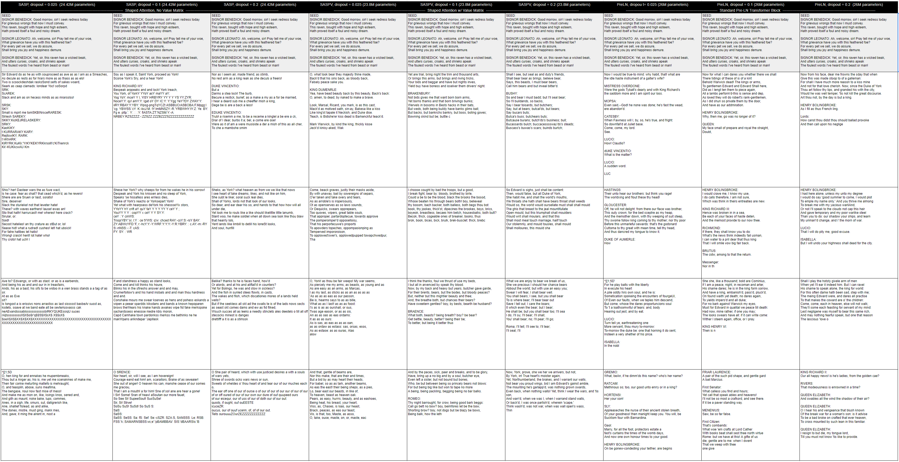
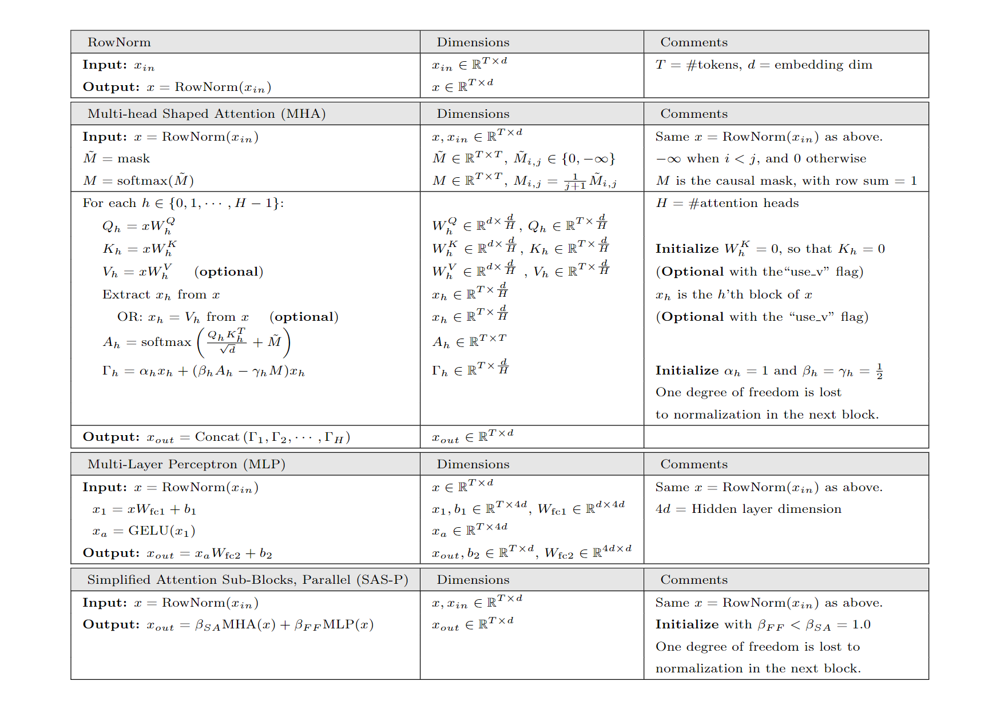

## Architecture Playground

I forked Andrej Karpathy's [nanoGPT](nanoGPT (https://github.com/karpathy/nanoGPT) to create an easy-to-use playground for experimenting with transformer architectures.  nanoGPT is a simple and fast repository for training/finetuning medium-sized GPTs.  The local instructions for settup for this repo are found [here](nanoGPT-README.md). 

## Simplified Transformer Blocks

This fork of nanoGPT adds an implementation of the transformer architecture described in the  [Simplifying Transformer Blocks](https://arxiv.org/abs/2311.01906) paper.  The main additons are the `SimplifiedTransformerBlock` and `CausalShapedAttention` classes to the `model.py` file, with some modifications to the supporting code to run the implementation.  `SimplifiedTransformerBlock` is used as a drop in replacement for the `Block` class in `model.py`. 

Details for the method come from the paper [Simplifying Transformer Blocks](https://arxiv.org/abs/2311.01906), in which Bobby He and Thomas Hofmann @ ETH Zurich provide a simplification of the transformer block.  Their approach uses signal propagation concpets and careful experimental analysis to trim down and re-organize the block architecture.  The result is a training-parity-efficient architecture for transformers that (1) reduces the number of normalization layers, (2) parallelizes the attention and feed-forward network layers, and (3) removes skip connections.  Their approach additionally shows that the Value (V) and post-attention Projection matricies (W_O) are not necessary for stable training in the new architecture, reducing total parameter count in the block.

<p align="center">
   
</p>

Shaped Attention is developed and detailed by the ETH group, U. Toronto, and U. Oxford in [Noci, Li, Li, He, Hoffman, Madison, and Roy; The Shaped Transformer: Attention Models in the Infinite Depth-and-Width Limit](https://arxiv.org/abs/2306.17759)


One output from the `CausalSimplifiedTransformer` class on the `train_shakespeare_char` example is given below.  It does not currently work as well as the GPT-2 architecture already implemented in nanoGPT.  Since the Simplified Transformer has fewer parameters than a standar transformer, the embedding dimension was increased to get approximately the same number of parameters (10.61M) as the reference GPT-2 implementation (10.65M).  


```
 GRETESTESTER:  
 And, if if John Montague-commothzen:  
 God know you will shall have you reportain:  
 What, my lord, I will be so? Or, I'll do you know  
 My provost, I have so?  
 What, what shall you, good lord.  
   
 GLOUCESTER:  
 My lord, I'll know your honour Gloucester?  
 I mayou no lord: I do, I do cannot elewhen I.  
   
 GLOUCESTER:  
 I can me, I pray you for I such be so?  
 I know't you the I have I do know?  
 I need, I have to done.  
   
 GLOUCESTER:  
 I pray you on I please to know  
 I go profeI I shake I do her so I phoI hav  
    
 ####################################################################################   
    
 Brother Clanues Edward's by joyfulty;  
 For which werence country: and for heard;  
 And for thesen our cannot from me home with man's land,  
 And for thereof York. Warwick, how be grief,  
 And, and, and you strown in the hands.  
   
 QUEEN ELIZABETH:  
 The words hand you the far of your make,  
 And your confe honour day for his minds,  
 And you for and be no son, and you, And you many did,  
 And your his gardmn crown some, and wear your did eas,  
 And you fathed you mother, as you well.  
   
 ARTHARALEAR:  
 Ay, you found you  
```

### Samples from 9 different models 
Models: PreLN / SASP / SASPV @ dropout = 2.5%, 10%, and 20%  
All models trained from scratch using the initializations indicated in the following section.  
Seed: Same seed.  
Samples per model: 5


<p align="center">
   
</p>

## Simplified Attention Sub-Block Algorithm, Parallel (SAS-P)
This is a more extensive description of the SAS-P block algorithms, parallelizing the Shaped Multi-Head Attention and standard Multi-Layered Perceptron components.


